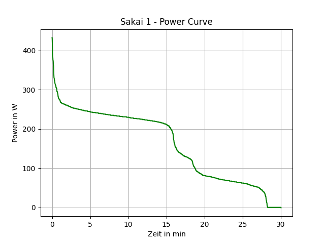
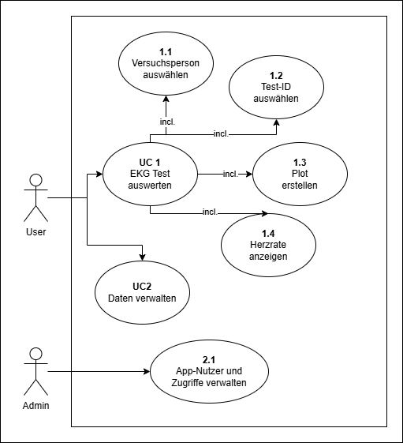
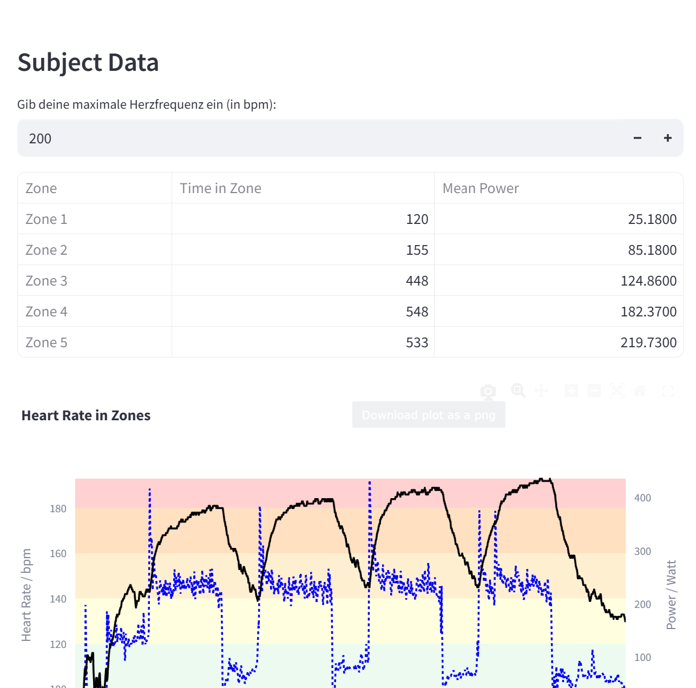
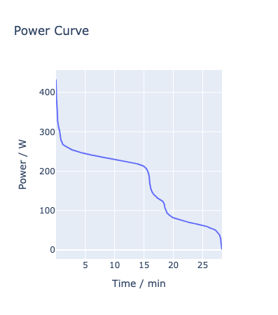

# PUE_SS25

Hier werden die Sakai-Aufgaben für Programmierübung 2 erstellt.

# Funktionsumfang

Hier liegt ein Skript 'main.py', mit dem wir eine Leistungskurve plotten.

# Anforderungen

- Zum Installieren wird das Projekt gecloned
- Im Terminal werden folgende Befehle in die Powershell geschrieben
    - 'pdm install'
- Zum Starten des Projektes wird ein 'activity.csv' benötigt, welches dann in 'power_curve.py' zu einem Plot gemacht wird

# Sakai Aufgabe 1 - Power Curve Plot

# EKG-App

## Funktionsbeschreibung

Die app soll es der __Diagnostiker:in__ ermöglichen, EKG-Daten verschiedener __Patient:innen__ zu erfassen, zu speichern und auszuwerten. Die App soll eine einfache und intuitive Benutzeroberfläche bieten, um die Bedienung zu erleichtern. Der __Admin__ kann __Diagnostiker:innen__ anlegen.

### Use Cases

- UC1: EKG-Daten auswerten
    - bla
- UC2: Daten verwalten

## Implementierung

__Use Case 1__ Die User Journey für die Diagnostiker:in wenn Sie einen Test auswerten möchten, folgt aus dem Activity Diagramm:

### Design

Hier folgen erste Entwürfe eines UI Designs. Das Design ist für die Darstellung auf einem PC optimiert (Querformat). Keine separaten Frames.

## Bneutzung

` .\.venv\Scripts\activate`
`streamlit run .\main.py`

## EKG-App Verwendung

Der Proband wird ausgewählt und im Anschluss kann die maximale Herzfrequenz im Input-Feld eingegeben werden. Im Anschluss werden wird eine Tabelle mit Zonen und ein dazugehöriger Graph ausgegeben. Es wird __plotly__ benötigt um die HR-Daten Ploten zu können (`pdm add plotly`).

## Sakai Aufgabe 4 - Erstellen einer Power-Curve

- Im Terminal wird folgendes ausgeführt
    - "pdm add numpy"
    - "pdm add pandas"
    - "pdm add plotly.express"
    - "pdm add nbformat"
- Zum Starten des Projektes wird ein 'activity.csv' benötigt, welches dann mittels 'analyze_power.py' geplottet wird
-für die Variable "FILE PATH", muss der Pfad der activity.csv angegeben werden. Dieses wird dann über die Variable dem Argument der Funktion übergeben.

